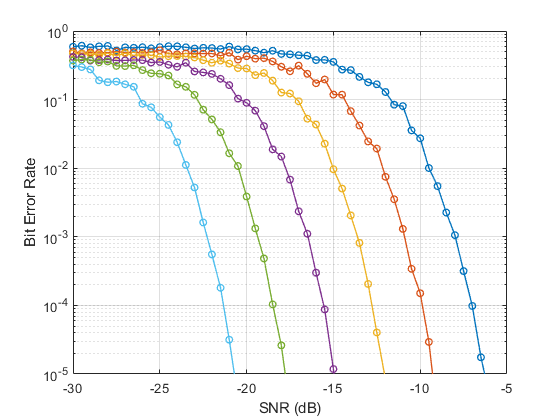
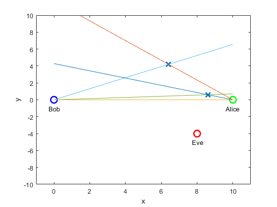

# lora-simulator

lora-simulator is a LoRa physical layer simulation platform.

## Examples

- Simulating LoRa BER function of SNR and Spreading Factor :

  

- Simulating a Ray-casting MiSo channel + eavesdropper (Eve) :

  

## What's inside

- `/examples` examples scripts

- `/functions` 
- `/playground_beamforming` scripts related to Beamforming 
- `/playground_beamforming` scripts related to LoRa 

## Next

Adding MiSo (multiple-antennas) channel support to the simulator

Implementing synchronization loop
